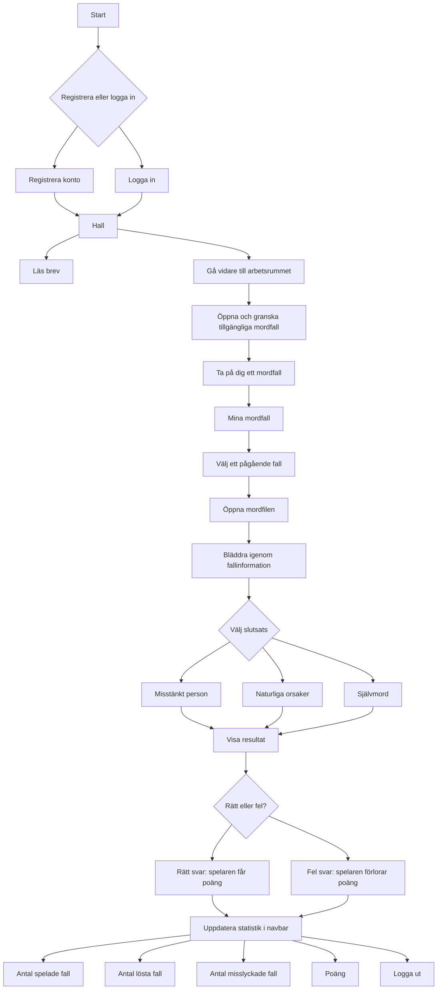

# The Final Clue (Version 1)

## Om spelet

The Final Clue är ett detektivspel som ursprungligen byggdes som en konsolapplikation och som nu vidareutvecklas som ett fullstack-projekt.

Spelet är inspirerat av Agatha Christies klassiska deckare samt moderna mysteriespel och sällskapsspel som *Unsolved*. Fokus ligger på att analysera ledtrådar, granska bevis och dra slutsatser för att lösa olika fall.

## Bakgrund

London, 1939.

Efter att ha dragit dig tillbaka från detektivyrket blir du kontaktad av en gammal vän vid Scotland Yard. Polisen står inför flera svåra fall och behöver din hjälp.

Din uppgift är att granska bevismaterial, läsa vittnesmål, studera brottsplatser och analysera ledtrådar för att avgöra vad som egentligen har hänt.

Vem är den skyldige?

Och viktigast av allt – har ett brott ens begåtts?

## Om innehållet

Spelets berättelser bygger på egna idéer inspirerade av klassiska deckare. Texterna har därefter bearbetats med hjälp av AI.

Samtliga bilder i spelet är AI-genererade. Vissa bilder innehåller avsiktligt placerade ledtrådar som spelaren förväntas upptäcka och använda under utredningen.

## Nuvarande innehåll

Version 1 innehåller för närvarande:

* 3 spelbara fall
* Textbaserad utredning
* Ledtrådar i både text och bildmaterial
* Möjlighet att analysera bevis och fatta beslut om utgången i varje fall

## Funktioner

- Registrering och inloggning
- Visning av tillgängliga fall
- Acceptera och spela fall
- Visning av ledtrådar i text och bild
- Resultatsystem baserat på spelarens val
- Responsiv design

## Tekniker

- React
- Vite
- React Router
- CSS
- JWT-autentisering
- ASP.NET Core Web API

## Deploy

Frontend är deployad online.

Observera att backend-API:t kräver egen connection string och JWT-nyckel vid lokal körning.

# Spelflöde

